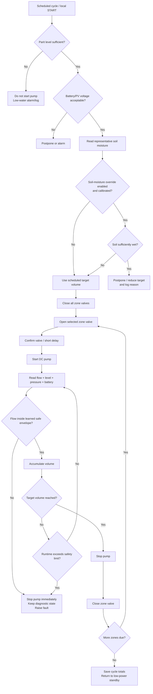

# Evidence-Based Design and Validation Plan for an Automated Irrigation Retrofit in a 100+ m Citrus Orchard

## Executive summary

The orchard should **not** be treated as a blank-slate irrigation project. Its existing system already performs an important function:

**river → gasoline pump → earthen parit/ditch → water available along the orchard.**

The parits therefore function as distributed water buffers. The principal operational bottleneck is the **last-mile transfer from the parit to each tree**, which is still performed manually. According to the project inputs, the orchard contains approximately **500–600 trees**, is more than **100 m long**, has three principal parit/row corridors, no grid electricity, and currently requires four workers at approximately **Rp100,000/person per irrigation cycle**. The farmer's present target of **15 L/tree/cycle must be treated as a value to verify**, not as an established agronomic requirement.

The corresponding farmer-target volume is:

\[
500 \times 15 = 7{,}500\text{ L/cycle}
\]

to

\[
600 \times 15 = 9{,}000\text{ L/cycle}.
\]

The most important hydraulic finding is that the user's concern about unequal watering is correct. A naive retrofit consisting of a pump feeding a long pipe from one end with ordinary holes or pressure-sensitive microtubes can deliver substantially more water near the pump than at the far end. FAO describes emitter discharge by \(q=KH^x\): ordinary emitters respond to pressure changes, while pressure-compensating emitters have an exponent near zero over their compensation range and are specifically used to reduce discharge variation on long or sloping laterals. citeturn23search1turn23search13

The recommended design therefore uses **three complementary mechanisms**, rather than trying to solve the problem electronically alone:

1. **Hydraulic balancing:** divide the orchard into appropriately sized zones and supply long laterals from their midpoint or, where justified, as a loop.
2. **Pressure regulation at the tree:** use pressure-compensating emitters rather than unregulated holes/microtubes.
3. **Electronic volumetric control:** use a calibrated flow meter to control the **total volume delivered to each zone**, with low/high-flow fault detection.

A particularly cost-effective outlet arrangement is not necessarily two expensive PC emitters per tree. A better candidate for prototype testing is **one 12–15 L/h pressure-compensating emitter per tree feeding a short two-way “spider” or equal-length microtube pair to two wetting points around the tree**. Netafim's PCJ family, for example, includes 15 L/h pressure-compensating emitters, specifies a 0.5–4.0 bar operating range for standard PCJ models, and explicitly supports microtube/spider outlets. Its recommended filtration is 130 µm/120 mesh. citeturn23search11turn29view1turn30view0

For a representative **50-tree zone**, one 15 L/h PC emitter per tree produces:

\[
Q_\text{zone}=50\times15=750\text{ L/h}=12.5\text{ L/min}.
\]

If the farmer's 15 L/tree target is retained, the nominal run time is approximately **one hour per zone**. This is very close to the duty point of commercially available small 24 V diaphragm pumps; for example, an official SEAFLO 24 V model delivers about **14.4 L/min at 1.38 bar while drawing 5.22 A**, or approximately 125 W. That is an example duty point, not yet a final pump selection. citeturn32view0

Most importantly, an illustrative stepwise hydraulic calculation shows why **center feeding matters**. For 50 trees distributed along 100 m, using approximately 20 mm OD PE with 17 mm internal diameter, feeding from one end gives an estimated pipe/emitter-insertion loss of about **2.73 m water head, or 0.27 bar**. Feeding the same lateral at its midpoint—two 50 m halves of 25 trees—reduces that estimated loss to about **0.42 m, or 0.041 bar**, before elevation, filter, valve, and fitting losses are added. With a smaller 13.2 mm-ID line, the one-end loss rises to roughly **9.53 m/0.94 bar**, whereas center feeding reduces it to about **1.45 m/0.14 bar**. These are illustrative calculations, but they demonstrate why pipe diameter and feed topology cannot be an afterthought. Manufacturer PCJ design data likewise show that permissible lateral length changes strongly with pipe diameter, emitter flow, pressure, spacing, and slope. citeturn28view0turn29view0

The recommended full-scale concept is therefore:

> **River → existing gasoline pump → existing parits → local solar/DC distribution stations → filtered and pressure-controlled multi-zone irrigation → center-fed or looped PE laterals → PC emitter at each tree → short microtube tails to the root area.**

Importantly, **12 zones does not mean 12 complete electronic devices**. A plausible starting architecture is **three local stations, one per parit, each controlling three to five hydraulic zones**. If four zones per station eventually proves appropriate, the full system has 12 zone valves but only approximately **three pumps, three flow meters, three filters, and three controllers**. The number 12 is a design hypothesis, not a specification; exact zone count should only be fixed after elevation, tree spacing, parit geometry, and actual pump measurements are available.

This approach is well aligned with ASABE's microirrigation engineering practice, which explicitly treats application adequacy/uniformity, filtration, water treatment, installation, and system performance as fundamental design concerns. citeturn23search0turn23search10

## Design basis, constraints, and the unequal-distribution problem

### The real problem is not simply “lack of irrigation”

The existing parit system should be considered an **asset**. It eliminates the need for workers to walk all the way back to the river for every bucket and already transports bulk water longitudinally across the orchard. Replacing it immediately with hundreds of meters of pressurized mainline would spend money to duplicate an existing function.

A stronger CD-1 problem formulation is therefore:

> **The existing irrigation system can transport water from the river to the orchard and distribute it longitudinally through earthen parits, but the final delivery from the parits to individual citrus trees remains labor-intensive, unmetered, and potentially non-uniform. A naive pressurized retrofit would introduce an additional hydraulic-uniformity problem because friction and elevation cause pressure variation along long laterals.**

That formulation is more defensible than saying “the orchard has no irrigation system.”

The key project constraints are summarized below.

| Constraint / input | Engineering consequence |
|---|---|
| 500–600 trees | Full-cycle volume is large enough that per-tree automation should not require one controller or one valve per tree. |
| 100+ m site | Long piping can create significant friction and pressure variation. |
| Three existing parit corridors | They can be reused as distributed buffers/intake points instead of constructing a completely new source network. |
| No PLN/grid electricity | Distribution pump and controls must be solar/battery powered or otherwise locally autonomous. |
| Remote site | Irrigation cannot depend on cloud connectivity or continuous Internet service. |
| Muddy/particulate parit water | Intake placement, settling, filtration, flushing, and clog detection are central—not optional accessories. |
| Farmer target = 15 L/tree/cycle | Use as the initial engineering setpoint, but mark **TO VERIFY** agronomically. |
| Labor = four people × Rp100,000/cycle | Current labor cost is approximately **Rp400,000/cycle** from the project input. |
| Existing gasoline pump | Retain it for high-flow parit filling and emergency backup rather than immediately replacing a working asset. |

The 15 L/tree figure should not be presented in CD-1 as a scientifically established citrus requirement. FAO irrigation scheduling determines crop water requirement from crop evapotranspiration and local climate/soil/root conditions; irrigation depth and interval are site dependent. Indonesian citrus research also reports markedly different irrigation quantities under different soils, cultivars, intervals, and irrigation treatments. The correct wording is therefore **“15 L/tree is the farmer's current operational target and will be verified during subsequent design stages.”** citeturn10search0turn10search2turn10search3

### Why a simple long pipe will not solve the problem

For a non-pressure-compensating outlet, discharge changes as pressure changes. FAO expresses this relationship as:

\[
q=K H^x
\]

where \(q\) is emitter discharge, \(H\) is pressure head, \(K\) is a coefficient, and \(x\) describes pressure sensitivity. A pressure-compensating device has \(x\) near zero over its regulated range; conventional emitters can have much larger exponents. Consequently, ordinary microtubes or holes near the pump can emit significantly more than those at the far end when pressure declines because of pipe friction or elevation. citeturn23search1

This means a **flow meter alone is not enough**. Suppose the controller sends exactly 750 L into a 50-tree zone. The flow meter proves only:

\[
\sum_{i=1}^{50}V_i=750\text{ L}
\]

It does **not** prove:

\[
V_1=V_2=\ldots=V_{50}=15\text{ L}.
\]

A badly designed lateral could theoretically send 25–30 L to some trees and much less to others while the flow meter still reports the “correct” total zone volume.

Pressure-compensating emitters address this problem hydraulically, provided every emitter remains inside its specified pressure-compensation range. Netafim's standard PCJ models, for example, list an exponent \(x=0\) and a 0.5–4.0 bar working range for flows from 0.5 to 15 L/h. A pressure-compensating emitter does **not** create pressure; if the last emitter falls below its minimum compensation pressure, uniformity will again deteriorate. citeturn29view1turn30view0

Peer-reviewed work similarly finds that pressure-compensating emitters substantially reduce the effect of pressure fluctuations, although clogging and diaphragm aging can eventually degrade their performance. That reinforces the need for filtration, flushing, and periodic field uniformity testing rather than assuming “PC emitter = permanently perfect distribution.” citeturn23search2turn23search3turn23search4

### Pressure-compensating emitters versus plain microtubes

Plain microtubes are attractive because they are cheap and easy to obtain. Their weakness is precisely the project's principal problem: their discharge is governed by tube diameter, length, and inlet pressure. Experimental and analytical studies of microtube emitters show that careful sizing can produce acceptable uniformity, but pressure variation, connector losses, manufacturing variation, and clogging have greater influence than with well-designed pressure-compensated outlets. citeturn17search2turn17search3turn17search5

For this orchard, the best compromise is therefore:

> **PC emitter = metering element; short microtube = delivery element.**

A 12–15 L/h PC emitter can be mounted on the lateral beside each tree, with a short two-way spider or two equal-length microtube tails placing the water at two positions around the root zone. Netafim explicitly supports PCJ outlets connected to 3 or 4 mm-ID microtube and spider assemblies. citeturn23search11

This arrangement preserves low-cost microtube where it is useful without asking the microtube itself to solve the pressure-uniformity problem.

### Filtration is a primary subsystem

Because water first enters an earthen ditch, the system should assume suspended soil, organic matter, and possibly sand. Netafim specifies **130 µm/120-mesh filtration** for PCJ emitters, recommends a hydrocyclone where sand concentration exceeds 2 ppm, and calls for additional pretreatment when sand/silt/clay solids exceed 100 ppm. citeturn30view0

The practical station should therefore be arranged approximately as:

```text
PARIT
  │
  ├─ floating / raised intake
  │     avoids sucking directly from ditch bottom
  ▼
coarse intake strainer
  ▼
DC pressure pump
  ▼
120-mesh / 130 µm disc filter
  ▼
pressure gauge / optional pressure sensor
  ▼
flow meter
  ▼
zone manifold
```

A disc filter is a strong candidate because disc filtration is used specifically where dirt-loading and organic material are significant, but the final filter type should follow an actual water/sediment inspection rather than being selected from photographs alone. citeturn1search4turn1search7

The parit itself can also help through sedimentation: the distribution intake should be elevated above the bottom or use a floating pickup so settled sediment is not continuously sucked into the pump.

## Recommended retrofit architecture and hydraulic layout

### Full-system architecture

The recommended full-scale architecture is **distributed by parit, not by tree**:

```text
                             RIVER
                               │
                    existing gasoline pump
                               │
                ┌──────────────┼──────────────┐
                ▼              ▼              ▼
            PARIT A         PARIT B         PARIT C
                │              │              │
          STATION A       STATION B       STATION C
       filter / pump    filter / pump    filter / pump
       flow / control   flow / control   flow / control
                │              │              │
        ┌───────┼──────┐       ...            ...
        ▼       ▼      ▼
      Zone    Zone    Zone
       A1      A2      A3/A4

       each zone:
       valve
         ↓
       PE lateral
         ↓
       PC emitter/tree
         ↓
       short microtube tails
         ↓
       root-zone wetting points
```

A candidate full-scale configuration is **three stations × approximately three to five zones/station**. A 12-zone design would therefore mean three station boxes and twelve independently controlled pipe branches—not twelve pumps, twelve solar arrays, or twelve ESP32s.

The optimal count must be determined from **hydraulic limits**, not from a desire to have a round number. Smaller zones lower instantaneous flow and friction loss but increase valve count and irrigation time; larger zones reduce valve cost but demand larger pumps/pipes and make pressure management harder.

### Center-fed zone: preferred baseline

The cheapest strong improvement over end feeding is to bring the pressurized supply to approximately the **middle of the active lateral**, so the maximum hydraulic path is roughly half as long.


The illustration is schematic, not to scale. The station does not have to physically sit beside the exact midpoint; a submain can carry water from the station to the midpoint and split into left/right lateral halves.

This is the preferred first prototype because it gives much of the hydraulic benefit of a loop while using less pipe and being easier to diagnose.

### Loop/ring zone: stronger pressure balancing but more pipe

A loop closes the lateral so outlets can be supplied from two directions. This can reduce pressure variation and can make flushing or reverse-flow maintenance easier, but it costs additional pipe and its hydraulic behavior is a network problem rather than a simple one-direction lateral. Research on looped drip layouts reports improved pressure distribution under appropriate configurations. citeturn2search0turn2search12


The loop is therefore a **secondary design option**, especially where the surveyed terrain is irregular, a zone is unusually long, or flushing/redundancy proves valuable. For a relatively flat orchard, center-fed laterals with PC emitters will probably give a better cost-performance ratio.

### Representative hydraulic calculation

To quantify the near-versus-far problem, consider a deliberately simple representative case:

| Assumption | Illustrative value |
|---|---:|
| Trees in zone | 50 |
| Lateral length | 100 m |
| Illustrative tree spacing | 2 m |
| PC emitter | one 15 L/h emitter/tree |
| Target volume | 15 L/tree — **farmer target, to verify** |
| Total target volume | 750 L |
| Zone operating flow | 750 L/h = 12.5 L/min |
| Nominal irrigation duration | 1 h |
| Terrain | assumed flat for friction comparison only |

Netafim's technical information provides representative internal diameters and emitter insertion-loss coefficients for several PE sizes; the manufacturer's lateral tables also demonstrate the effect of slope, inlet pressure, pipe diameter, emitter flow, and spacing on allowable lengths. citeturn28view0turn29view0

Using a stepwise Darcy–Weisbach calculation in which flow decreases after every emitter, and including the manufacturer's emitter insertion-loss coefficient, gives the following **illustrative** results:

| Lateral example | One-end feed, 100 m | Center feed, two × 50 m | Hydraulic interpretation |
|---|---:|---:|---|
| ID ≈ 13.2 mm | **9.53 m head ≈ 0.94 bar** | **1.45 m ≈ 0.14 bar** | Too risky for this flow unless pressure is high; one-end arrangement could drive the far end below the PC range. |
| ID ≈ 17.0 mm | **2.73 m ≈ 0.27 bar** | **0.42 m ≈ 0.041 bar** | Very attractive center-fed candidate. |
| ID ≈ 21.2 mm | **0.95 m ≈ 0.094 bar** | **0.15 m ≈ 0.014 bar** | Excellent hydraulically, but higher pipe cost. |

These numbers exclude terrain, filter pressure drop, valve/fitting losses, intake losses, and submain losses. They should therefore **not** be copied directly into a construction specification.

The relationship is nevertheless decisive. For the representative 17 mm-ID line:

\[
h_{f,\text{end feed}}\approx 2.73\text{ m}
\]

versus:

\[
h_{f,\text{center feed}}\approx0.42\text{ m}.
\]

That is about an **85% reduction in lateral friction loss** in this illustrative case.

Elevation can matter even more than friction: every 1 m increase in elevation costs approximately 1 m of pressure head, roughly 0.098 bar. Consequently, a 3 m uphill rise would consume roughly 0.29 bar before friction and filter losses are included.

This leads to an important design rule:

> **The farthest/highest PC emitter, not the emitter beside the pump, determines the required station pressure.**

A practical prototype should initially aim to maintain perhaps **0.8–1.2 bar at the lateral inlet**, while instrumenting the distal end to prove that it remains comfortably above the selected emitter's minimum operating pressure. That pressure range is a design starting point, not a final number.

### Why the pressure-compensating emitter is still necessary after center feeding

Center feeding dramatically reduces friction, but it does not eliminate:

- terrain elevation,
- small diameter variations,
- fitting losses,
- filter fouling,
- pressure variation as the solar pump operating point changes,
- manufacturing variation.

PC emitters therefore provide the second layer of uniformity. FAO specifically identifies self-compensating emitters as a solution for long or sloping laterals where pressure variation would otherwise translate into discharge variation. citeturn23search1turn23search13

A useful validation metric is low-quarter distribution uniformity:

\[
DU_{lq}=
\frac{\text{mean discharge of lowest 25% of sampled emitters}}
{\text{overall mean discharge}}
\times100\%.
\]

FAO uses the low-quarter-to-average relationship to characterize field emission uniformity; uniformity is affected by pressure differences, emitter characteristics, manufacturing variation, and clogging. citeturn0search3

For the capstone, **DU\(_{lq}\) ≥ 90% after commissioning** is a reasonable project-level target for the prototype. That should be presented as an engineering acceptance criterion chosen for the project, rather than falsely attributed as a universal citrus standard.

## Automation, energy, and fault-tolerant control

### Station electronics

For a Computer Engineering capstone, the hydraulic system should remain functional without Internet access. The controller's job is to operate the physical process locally.

A sensible station contains:

| Element | Purpose |
|---|---|
| ESP32 or STM32 | Local state machine, sensor acquisition, valve/pump control |
| RTC | Reliable irrigation timing without network time |
| Pulse flow meter | Totalized zone volume and instantaneous-flow diagnostics |
| Parit level sensor | Low-water / dry-run protection |
| Representative soil-moisture sensors | Advisory scheduling input after field calibration |
| Optional pressure sensor | Distinguish blockage from rupture and validate hydraulic design |
| Motorized/latching zone valves | Select one zone at a time |
| MOSFET/relay/driver stage | Pump and actuator interface |
| Local buttons | Start, stop, manual zone selection, maintenance |
| Small LCD/OLED/status LEDs | Show zone, liters, flow, level, battery, faults |
| SD card or nonvolatile log | Irrigation and fault history |
| Wi-Fi/BLE | Local technician/phone interface |
| Optional LoRa | Low-power station-to-station/gateway communication |

ESP32 is particularly attractive for the first prototype because Wi-Fi and Bluetooth are integrated and the device provides extensive GPIO, counters, ADC capability, and low-power modes. citeturn13view1turn14view0

LoRa becomes useful when the three station nodes are geographically separated and reliable Wi-Fi coverage is unavailable. Semtech's LoRa transceivers are designed for long-range, low-data-rate communication at low receive power, but actual orchard range must be measured because vegetation and terrain influence RF propagation. citeturn7search0

**Internet should never be in the critical control loop.** A phone or gateway may display data, but loss of communication must not prevent the station from completing—or safely aborting—an irrigation cycle.

### Flow-volume control logic

The fundamental control variable should be **measured water volume**, not merely elapsed time.

For zone \(z\):

\[
V_{\text{target},z}=N_z\times V_\text{tree}.
\]

For 50 trees and the farmer's current 15 L/tree setting:

\[
V_{\text{target}}=50\times15=750\text{ L}.
\]

The controller counts calibrated flow-meter pulses and integrates:

\[
V=\int Q(t)\,dt.
\]

The proper sequence is illustrated below.



The order **open valve → start pump** and **stop pump → close valve** avoids intentionally dead-heading the pump.

### Why volume control must also monitor flow rate

Suppose a calibrated 50-tree zone normally flows at 12.5 L/min. If several emitters clog, flow may fall to 10.5 L/min. A controller that cares only about total volume will simply run longer until 750 L passes through the meter. That can overwater the healthy emitters while the blocked trees remain underwatered.

The controller therefore needs two conditions:

\[
V\le V_\text{target}
\]

and

\[
Q_\text{min}<Q(t)<Q_\text{max}.
\]

A calibrated **expected-flow envelope** becomes a simple but powerful fault detector.

For example:

| Sensor pattern | Likely fault | Controller response |
|---|---|---|
| Pump ON, \(Q\approx0\) | empty intake, pump fault, closed/stuck valve, severe blockage | stop |
| Flow significantly below baseline | dirty filter, multiple clogged emitters, weak pump, low parit level | stop/flag maintenance after persistence timer |
| Flow significantly above baseline | burst pipe, disconnected lateral, open flush valve | immediate stop |
| Low flow + abnormally high pressure | downstream blockage / closed valve | stop |
| High flow + low pressure | pipe rupture / major leakage | stop |
| Parit level below threshold | dry-run risk | immediate stop |
| Target volume not reached before max runtime | flow problem or sensor failure | stop |
| Flow pulses continue with pump OFF | valve leak, siphoning, meter fault | fault log |
| Battery undervoltage | battery protection / incomplete cycle risk | postpone safely |
| Controller reset mid-cycle | possible duplicate irrigation | recover last state from nonvolatile memory; do not automatically re-water entire zone |

Low-cost pulse sensors can work well after calibration, but published measurements show that accuracy varies substantially with sensor type, hydraulic regime, and calibration. A 2026 low-cost irrigation measurement study obtained errors around 1.65–1.75% after calibration, whereas research on inexpensive YF-S201 sensors has found much larger uncertainty under unfavorable low-flow conditions. Indonesian work likewise demonstrates that calibration can significantly improve volume measurement. citeturn26search0turn26search4turn26search5turn26search7

Therefore, the capstone should **calibrate every flow-meter model volumetrically at several operating flows**. Do not copy the nominal “pulses/L” constant from an online listing and assume it is correct.

A practical project acceptance target would be:

\[
|\text{flow-meter volume error}|\le5\%
\]

against a reference tank/container over the actual operating range.

### Valve selection

For an off-grid system, a conventional continuously energized solenoid is not automatically the best choice.

A **motorized full-port ball valve** is attractive because selected designs consume energy mainly while changing position and offer little hydraulic restriction. The main disadvantage is that many three-wire designs remain in their last position after power loss. That is manageable here because the pump itself is the pressure source: firmware must default to **pump OFF**, so a valve stuck open during a power failure does not continue pressurized watering.

A **DC-latching irrigation solenoid valve** is also attractive because only a pulse is needed to change state. However, the specific valve must be checked for its minimum operating pressure; some diaphragm irrigation valves depend on differential pressure. Battery-powered commercial irrigation controllers routinely use DC-latching solenoids, confirming the suitability of that actuation principle for off-grid irrigation. citeturn7search7

For the first prototype I would use a **12/24 V full-port motorized ball valve with position limit switches**, because it is simple to drive, works at very low differential pressure, and makes valve-state validation easier. A current Indonesian retail example for DN25/1-inch 12 V motorized ball valves is roughly Rp378,000, although field-grade component selection should not be based on price alone. citeturn24search6

### Soil-moisture sensing should be secondary at first

Do not put a cheap moisture probe under every tree. Soil-water patterns under drip irrigation are highly spatially variable, and orchard studies show that sensor location relative to the emitter, soil, root zone, and wetting bulb materially changes readings. Low-cost capacitive sensors can perform well after field-specific calibration but can show much larger errors when laboratory calibration is transferred directly to real soils. citeturn27search0turn27search1

The sensible first deployment is approximately **two representative sensing locations per hydraulic/soil-management area**, possibly at different depths once root depth is established. A recent orchard study found that a small number of strategically chosen sites can represent field-scale moisture considerably better than arbitrary single-point placement, while highly heterogeneous fields require more sensors. citeturn27search4

During the prototype, soil moisture should therefore be used primarily as:

> **“Should we irrigate now?”**

rather than:

> **“Exactly how many liters does tree 183 require?”**

The first version can retain a conservative schedule/volume setpoint while recording moisture data. Only after correlation with field observations should moisture be allowed to skip or reduce irrigation automatically.

### Solar and battery sizing

Indonesia has strong solar potential; ESDM reports typical daily solar radiation around **4.5 kWh/m²/day in western Indonesia, 5.1 in eastern Indonesia, and roughly 4.8 nationally**. A recent Indonesian power-sector technology catalogue likewise shows generally high and relatively stable solar irradiation across the archipelago. citeturn22search11turn22search13

For sizing, consider the representative 50-tree zone:

\[
Q=12.5\text{ L/min}
\]

with approximately 1 hour runtime.

A commercially documented 24 V pressure pump provides 14.4 L/min at 1.38 bar while drawing 5.22 A. Its electrical input is therefore:

\[
P=24\times5.22\approx125\text{ W}.
\]

citeturn32view0

If one station handles four equal zones sequentially:

\[
E_\text{pump}
=125\text{ W}\times4\text{ h}
\approx500\text{ Wh/event}.
\]

Allowing roughly another 30–70 Wh/event for controller, losses, valves, sensors, and uncertainty gives a planning figure around:

\[
E_\text{station}\approx0.55\text{ kWh/event}.
\]

This is deliberately conservative; actual energy must be recalculated from the pump's measured duty point.

Using **4.5 equivalent peak-sun-hours** and a preliminary system derating factor of 0.75:

For a 200 Wp module:

\[
E_\text{PV}
=200\times4.5\times0.75
=675\text{ Wh/day}.
\]

For 300 Wp:

\[
E_\text{PV}
=300\times4.5\times0.75
\approx1{,}013\text{ Wh/day}.
\]

Thus, **200 Wp is plausible but marginal for a station expected to run four representative zones in one day**, while approximately **300 Wp/station provides substantially more weather and aging margin**. The final calculation must use the exact orchard location, shading, pump efficiency, irrigation frequency, and measured head. Current Indonesian listings put 200 Wp modules roughly around Rp1.14–1.83 million depending on product and supplier. citeturn31search0turn31search2

There are two sensible energy architectures.

**Daylight-pumping architecture:** a PV array operates the irrigation pump primarily during strong sunlight, while a relatively small battery keeps the electronics alive. This is the lowest-cost design and is attractive because the parit already stores water.

**Battery-backed pumping architecture:** energy is stored so the pump can finish a full irrigation cycle independent of instantaneous sunlight. For a 0.55 kWh event requirement, a nominal 24 V × 30 Ah battery is 720 Wh and is marginal after reserve and conversion losses. A more comfortable 24 V × 40–50 Ah bank provides approximately 0.96–1.2 kWh nominal. Two locally available 12 V 50 Ah LiFePO₄ batteries in series would provide roughly:

\[
25.6\times50=1.28\text{ kWh nominal}.
\]

Current Indonesian marketplace prices for 12 V 50 Ah LiFePO₄ examples are approximately Rp0.85–1.5 million each, although quality/BMS specification varies considerably. citeturn31search4turn31search6

A 20 A MPPT controller provides ample current for a 200–300 W-class station at 24 V; current Indonesian listings range from low-cost sub-Rp500k units to roughly Rp1.0–1.5 million for more established MPPT products. citeturn22search1turn22search5turn22search7

For the capstone prototype, I would begin with **daylight pumping + a small controller battery**. Battery-backed pump operation should be added only if field testing proves it operationally necessary.

### Existing gasoline pump should remain

The gasoline pump is well matched to the bulk-transfer task: move a large volume from the river into the parit relatively quickly. The new low-power station handles the lower-flow, higher-control task from parit to tree.

This division avoids sizing an expensive PV array to replace an existing high-flow gasoline pump unnecessarily.

The recommended operational sequence becomes:

```text
Bulk fill:
River → gasoline pump → parits

Precise irrigation:
Parit → solar/DC station → controlled zone → individual trees
```

The gasoline unit also remains valuable as backup if the solar distribution system is temporarily unavailable.

As of October 1, 2026, Pertalite is listed at **Rp10,000/L**. However, no reliable fuel-cost claim should be made for this orchard until actual pump runtime and fuel consumption per parit-fill event are measured. citeturn25search0turn25search6

## Retrofit alternatives and indicative cost

### Comparison of three strategies

| Retrofit strategy | Approx. CAPEX tendency | Hydraulic uniformity | Automation complexity | Water efficiency | Labor reduction | Main risk | Assessment |
|---|---:|---|---|---|---|---|---|
| **Gravity/parit + microtubes or simple outlets** | Low | Low–medium | Low | Medium | Medium–high | Insufficient head; near/far flow variation; difficult balancing | Worth testing only if elevation survey shows useful gravity head. Cheapest but weakest solution to the user's main uniformity concern. |
| **Hybrid parit + solar/DC pressure station + center-fed PC emitters** | **Medium** | **High** | **Medium** | **High** | **High** | Filter maintenance, emitter clogging, pump/solar sizing | **Recommended. Reuses existing infrastructure and directly addresses non-uniformity.** |
| **New fully pressurized river-to-tree solar network** | High | High if engineered correctly | High | High | High | Large solar pump/mainline cost; single central failure; duplicates parit's existing distribution role | Technically valid but poor cost/retrofit fit unless parits prove unusable. |

Gravity irrigation is technically possible where elevation supplies adequate head, and FAO discusses elevated low-pressure reservoirs for small-scale drip systems. However, the cited standard PC emitter requires at least about **0.5 bar**, equivalent to roughly 5 m of water head before pipe/filter losses. Unless the orchard has several meters of favorable elevation, an earthen parit is unlikely to generate enough pressure for that particular PC emitter without a pump. citeturn23search8turn29view1

The hybrid option therefore gives the best balance of cost, controllability, and reuse.

### Indicative BOM for a 30–50 tree prototype

The prices below are **budgetary Indonesian retail planning figures, not procurement quotations**. Marketplace prices change frequently and product quality varies. The prototype should use field-testable components before committing to hundreds of units.

| Component | Prototype quantity | Indicative planning cost |
|---|---:|---:|
| 12–15 L/h PC emitter | 50 | Rp0.20–0.30 M |
| Two-way microtube/spider tails + stakes | 50 sets | Rp0.15–0.35 M |
| 20 mm-class PE lateral, ~100 m | 1 roll | Rp0.45–0.75 M |
| Coarse intake strainer | 1 | Rp0.05–0.15 M |
| 120-mesh disc filter | 1 | Rp0.07–0.15 M |
| 24 V distribution pressure pump, verified at ~12–15 L/min and ≥1 bar | 1 | Rp1.5–2.5 M planning allowance |
| 1-inch pulse flow meter | 1 | Rp0.12–0.20 M |
| Motorized 1-inch zone valve | 1–2 | Rp0.38–0.76 M |
| Pressure gauge + optional electronic pressure sensor | 1 set | Rp0.15–0.35 M |
| ESP32 + RTC + drivers | 1 | Rp0.10–0.20 M |
| LoRa module, optional | 1 | Rp0.09–0.12 M |
| IP-rated enclosure / connectors | 1 | Rp0.10–0.25 M |
| Level sensing | 1 | Rp0.05–0.20 M |
| Soil-moisture sensors, field-calibrated | 2 | Rp0.10–0.30 M |
| 200–300 Wp PV | 1 array | Rp1.1–2.2 M |
| MPPT/SCC + protection | 1 | Rp0.4–1.0 M |
| Small control battery | 1 | Rp0.3–0.7 M |
| Fittings, flush valve, cable, support, waterproof connectors | — | Rp0.4–0.8 M |

Current Indonesian listings support the order of magnitude used here: PCJ 8 L/h emitters are around Rp4,000–4,400 each; 20 mm irrigation PE is approximately Rp450,000–748,000 per 100 m in current examples; a 1-inch pulse flow sensor is roughly Rp124,000–181,000; and a DN25 motorized valve example is Rp378,000. citeturn24search0turn24search2turn33search1turn33search2turn24search9turn24search10turn24search6

The resulting prototype budget is approximately:

> **Rp5–9 million** for a daylight-oriented 30–50 tree field prototype,

or approximately:

> **Rp7–12 million** if a substantial battery is added for pump operation independent of sunlight.

The first figure is preferable for the capstone.

### Indicative full-orchard BOM

Full-scale cost is much more uncertain because the reported geometry—500–600 trees, three principal rows/parits, and 100+ m length—does not yet uniquely define actual pipe routing or tree spacing. That geometric ambiguity itself should be resolved during the site survey.

Using a working assumption of **three local stations and roughly 9–12 zones**, the order of magnitude is:

| Component | Full-scale quantity assumption | Indicative range |
|---|---:|---:|
| PC emitters | 500–600 | Rp2.0–3.0 M |
| Two-way microtube/spider assemblies | 500–600 | Rp1.5–3.0 M |
| PE lateral/submain | survey dependent, ~300–800 m planning range | Rp1.5–6.0 M |
| DC distribution pumps | 3 | Rp4.5–7.5 M |
| 120-mesh filters + coarse strainers | 3 sets | Rp0.4–0.9 M |
| Flow meters | 3 | Rp0.4–0.7 M |
| Motorized/latching zone valves | 9–12 | Rp3.4–4.6 M |
| ESP32 control stations + RTC + enclosure + drivers | 3 | Rp0.7–1.4 M |
| LoRa networking | 3 nodes + optional gateway | Rp0.3–0.7 M |
| Level/pressure/soil sensors | 3 station sets | Rp0.8–1.8 M |
| Solar PV | ~200–300 Wp × 3 stations | Rp3.4–6.5 M |
| MPPT/protection | 3 | Rp1.2–3.0 M |
| Fittings, flush ends, manifolds, cable, structures | — | Rp2–4 M |

A reasonable **pre-survey planning envelope** is therefore approximately:

> **Rp20–35 million** for a daylight-pumping full system,

with battery-backed pumping potentially moving the project toward:

> **Rp25–45 million.**

These ranges should **not** be put into CD-1 as a committed project cost. They are useful feasibility estimates for planning.

If the current system truly uses four workers at Rp100,000 each, the baseline direct labor expenditure is:

\[
4\times Rp100{,}000 = Rp400{,}000/\text{cycle}.
\]

If the retrofit reduces the watering task from four laborers to occasional one-person supervision, the potential direct labor saving is roughly Rp300,000/cycle; if no dedicated watering labor is required during automatic distribution, the theoretical maximum is Rp400,000/cycle. A Rp20–35 million system therefore corresponds to roughly **50–117 irrigation cycles of gross labor savings**, before maintenance, depreciation, remaining gasoline use, seasonal irrigation changes, and operator time are considered.

That economic calculation is much more defensible for CD-1 than claiming an unrealistic exact “payback in X months” before the number of annual irrigation cycles has been verified.

## Field measurements and validation plan for CD-2

The most valuable thing to do during CD-1 is collect the measurements that prevent CD-2 and CD-3 from becoming assumption-driven.

### Field-data checklist

| Measurement | Method | Why it matters |
|---|---|---|
| Exact tree count | count/map | Fixes required total volume. |
| Tree coordinates/spacing | tape/GPS sketch | Determines lateral length, number of outlets, and zone grouping. |
| Exact parit count and route | site map | Confirms whether “three rows” means three tree rows, three ditch corridors, or three irrigation blocks. |
| Parit length, width, depth | tape | Estimates buffer/storage and intake locations. |
| Water level when full | staff gauge/tape | Determines usable suction depth. |
| Water-level decline during irrigation | timed observations | Shows whether parit recharge/storage can support pump flow. |
| Parit-to-tree elevation | laser level, hose level, or surveying instrument | Determines gravity potential and static head. |
| Elevation along each 100+ m corridor | measurements every 10–20 m and high/low points | Essential for PC-emitter pressure margin. |
| Gasoline pump make/model | nameplate/photo | Enables valid Q-H and fuel analysis. |
| Gas pump suction height | measurement | Part of source-pump operating head. |
| Gas pump discharge hose diameter/length | measurement | Needed for existing-system losses. |
| Actual parit-fill time | stopwatch | Baseline performance. |
| Existing pump discharge | calibrated tank/time or suitable meter | Determines actual source capacity. |
| Fuel consumed per full irrigation/fill cycle | fill-to-fill or measured tank volume | Produces real gasoline operating cost. |
| Worker count and active time | stopwatch/interview | Establishes labor baseline. |
| Container/gayung capacity | volumetric measurement | Allows current manual application volume to be estimated. |
| Volume actually delivered to sampled trees | direct catch/counting, 20+ trees | Tests whether present watering is uniform. |
| Water sediment | jar settling test + representative water sample | Determines filtration/pretreatment severity. |
| Water source variability | observation dry/wet periods | Determines source reliability. |
| Solar shading | hourly observation/site survey | Determines viable PV location. |
| Wireless path | RSSI tests for Wi-Fi/LoRa | Determines communications architecture. |

### Baseline manual-irrigation experiment

Before installing anything, select trees distributed spatially across the orchard: near the beginning, one-quarter, middle, three-quarter, and far end of each representative corridor.

For perhaps **20–30 sampled trees**, measure or estimate actual delivered volume under the current manual method. Record:

\[
V_i,\quad i=1\dots n.
\]

Then calculate:

\[
\bar V=\frac{1}{n}\sum V_i
\]

and coefficient of variation:

\[
CV=\frac{s}{\bar V}.
\]

Also calculate low-quarter distribution uniformity:

\[
DU_{lq}=
\frac{\bar V_{\text{lowest quarter}}}{\bar V}
\times100\%.
\]

This turns the statement “the workers probably water unevenly” into an empirical result.

### Prototype validation

The 30–50 tree prototype should be tested in increasing levels of rigor:

| Test | Measurement | Proposed capstone acceptance |
|---|---|---|
| Flow-meter calibration | known container/reference volume | ≤ ±5% total-volume error |
| Pressure profile | zone inlet, quarter, midpoint, farthest outlet | every PC emitter remains above compensation minimum |
| Emitter discharge | catch volume from representative near/mid/far emitters | DU\(_{lq}\) ≥ 90% target |
| Zone total | programmed vs independently measured volume | ≤ ±5% |
| Per-tree application | representative catch/output test | near/mid/far differences within project tolerance |
| Solar autonomy | voltage/current/Wh during full zone cycle | completes designed operating cycle without undervoltage |
| Low-water fault | intentionally lower intake level | pump stops before dry-running |
| Blocked-filter simulation | partially restrict filter | low-flow/high-pressure fault detected |
| Leak simulation | open/break test branch | high-flow/low-pressure fault detected |
| Communication failure | disable gateway/Wi-Fi | local irrigation remains safe and autonomous |
| Power reset | reset controller mid-zone | no uncontrolled restart/double watering |
| Repeated-cycle test | approximately 20+ field cycles during capstone window | no progressive loss of uniformity without detected maintenance need |

ASABE's design practice emphasizes performance and uniformity, while research on operating drip systems shows that clogging changes distribution uniformity over time; consequently, field validation cannot stop at “water came out of every emitter once.” citeturn23search0turn18search0

Soil-moisture sensors should also be calibrated in the orchard's actual soil rather than treated as absolute moisture instruments straight from the box. A 2026 field study found substantially better performance from soil-specific field calibration than from directly applying laboratory calibration in the field. citeturn27search0

## Implementation roadmap, risks, and CD-1 positioning

### Recommended staged deployment

The highest-risk mistake would be purchasing hardware for all 500–600 trees before proving the hydraulics. The appropriate engineering sequence is:

| Stage | Scope | Decision produced |
|---|---|---|
| **Current CD-1 field characterization** | existing process, labor, volume, site geometry, source, parit, baseline uniformity | Proves the problem quantitatively. |
| **Bench hydraulic test** | pump + filter + flow meter + valve + 10–20 emitters | Calibrates flow sensor and confirms component compatibility. |
| **30–50 tree, one-zone prototype** | center-fed lateral, PC emitters, one solar station | Proves pressure and tree-to-tree distribution. |
| **Center-feed versus loop A/B test if needed** | same trees/components with alternative topology | Determines whether extra loop piping gives worthwhile improvement. |
| **One complete multi-zone station** | 3–4 zones on one parit | Proves valve sequencing, solar energy, fault logic, and unattended operation. |
| **Three-parit replication** | approximately 9–12 zones | Full orchard deployment. |
| **Seasonal optimization** | adjust liters/tree from verified agronomic data | Moves from automation to optimized irrigation management. |

### Principal risks and mitigations

| Risk | Severity | Mitigation |
|---|---|---|
| Near/far volume inequality | Critical | PC emitters + center-fed/loop topology + proper pipe diameter + pressure validation |
| Distal pressure below PC range | Critical | elevation survey; pressure sensor/gauge; resize pipe/zone/pump |
| Mud/clogging | Critical | elevated intake, coarse strainer, 120-mesh disc filter, flush ends, flow baseline monitoring |
| A few emitters clog but flow meter keeps running longer | High | expected-flow envelope + max runtime + periodic DU test |
| Parit empties before zone finishes | High | level sensor/interlock and measure parit drawdown |
| Solar energy insufficient on cloudy day | Medium | daytime scheduling, PV margin, optional battery, gasoline/manual backup |
| Pump selected from “maximum flow” advertisement only | High | select from measured **Q-H duty point**, not free-flow rating |
| Valve fails open | Medium | pump OFF is hydraulic fail-safe; position feedback where possible |
| Soil sensor gives misleading value | Medium | field calibration, multiple representative sensors, do not make it sole control variable initially |
| Electronics exposed to rain/insects | High | IP-rated box, glands, conformal coating where appropriate, fused outputs |
| RF/Internet failure | Low for irrigation | completely autonomous local control; LoRa/Wi-Fi only supervisory |
| Theft/vandalism | Site dependent | discreet mounting, mechanical enclosure, removable panel/battery where required |
| Full-scale cost becomes excessive | Medium | prove one station first; reuse parits; optimize number of zones and emitters from data |

### What should and should not appear in CD-1

For CD-1, the architecture above is best treated as a **forward design hypothesis that tells you what data to collect**, not as an already-finalized solution.

The strongest CD-1 root-problem statement is:

> **The citrus orchard currently relies on a gasoline pump and earthen irrigation ditches to transport river water along the cultivation area. Although this system reduces the distance workers must carry water, final application from the ditches to approximately 500–600 trees remains manual, labor-intensive, unmetered, and difficult to verify for uniformity. The site has no grid electricity and the irrigation water contains field-borne particulate matter. Any automated retrofit must therefore provide consistent per-tree water distribution across a site exceeding 100 m while operating independently of grid power and tolerating the available water quality.**

The CD-1 analysis should explicitly distinguish **four interacting engineering problems**:

| Problem dimension | Evidence to obtain |
|---|---|
| **Operational/economic** | four workers, Rp100k/person/cycle, cycle duration, annual/seasonal frequency |
| **Hydraulic** | pressure/head variation, elevation, unequal manual or potential automated distribution |
| **Water/resource** | target volume, actual volume, parit storage, source reliability |
| **Infrastructure/energy/environment** | no PLN, remote location, muddy water, outdoor operation |

That provides a genuinely multidisciplinary Computer Engineering problem rather than a superficial “ESP32 turns a pump on” project.

The engineering contribution then becomes much clearer:

> **An embedded closed-loop irrigation retrofit that converts an existing semi-manual parit distribution system into a measurable, fault-aware, off-grid, multi-zone water-delivery system.**

The recommended technical baseline going forward is therefore:

**Existing gasoline source pump retained → existing parits retained → one local distribution station per parit → elevated/clean intake → 24 V solar-powered pump → 120-mesh filtration → calibrated flow metering → pressure monitoring/regulation → multiple independently actuated zones → center-fed 20–25 mm-class laterals → one pressure-compensating emitter per tree with short dual microtube delivery tails → autonomous ESP32 control with local UI and optional LoRa supervisory networking.**

That architecture directly addresses the specific failure mode that started this discussion: **a tree near the pump must not receive 30 L while a far tree receives 5 L**. Electronics alone cannot guarantee that. The combination of **proper zone hydraulics, center feeding, pressure-compensating outlets, filtration, and flow-feedback control** can—and each layer is independently measurable and therefore suitable for rigorous capstone validation. citeturn23search0turn23search1turn23search2turn29view1